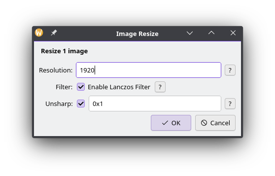
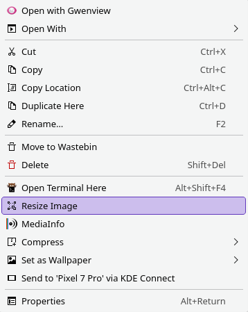

# KDE Service Menu - Image Resize

A KDE Dolphin context menu entry for resizing images using ImageMagick.

Right-click on one or more images in Dolphin to resize them with configurable options.



## Features

- **Resize** images to any resolution (width x height, width-only, or height-only)
- **Lanczos resampling filter** for high-quality downscaling (toggleable)
- **Unsharp mask** for post-resize sharpening (configurable)
- **Batch processing** of multiple selected images
- **Help popups** explaining each option
- Progress dialog with cancel support

Output files are saved alongside the originals with a `_resized` suffix.

## Requirements

- KDE Plasma 5 or 6
- [ImageMagick](https://imagemagick.org/) 7+
- Python 3 with PyQt6
- Dolphin file manager

### Arch Linux / CachyOS

```bash
sudo pacman -S imagemagick python-pyqt6
```

## Installation

```bash
./setup.sh -i
```

This copies:
- `image_resize.py` to `~/.local/bin/`
- `image_resize.desktop` to `~/.local/share/kio/servicemenus/`

## Uninstallation

```bash
./setup.sh -u
```

## Usage

1. In Dolphin, right-click on one or more image files
2. Select **Resize Image** from the context menu

3. Configure the resize settings:
   - **Resolution**: Target size (e.g. `1920`, `1920x1080`, `x1080`)
   - **Lanczos Filter**: Enable/disable high-quality resampling
   - **Unsharp Mask**: Post-resize sharpening value (e.g. `0x1`)
4. Click OK to process

### Resolution Formats

| Format | Example | Behavior |
|--------|---------|----------|
| `WIDTHxHEIGHT` | `1920x1080` | Fit within bounds, aspect ratio preserved |
| `WIDTHx` or `WIDTH` | `1920` | Set width, auto-calculate height |
| `xHEIGHT` | `x1080` | Set height, auto-calculate width |

## License

BSD 3-Clause. See [LICENSE.md](LICENSE.md).
